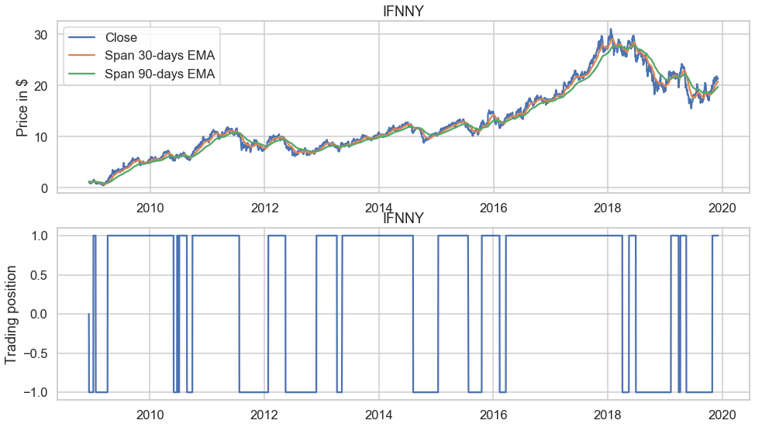

# IE-512-Decison-Analysis-Final-Project
Stock Market Decision Problem: The Code Used to Scrape, Modify and Analyze the Data

Contained in this repository is the jupyter notebook file in which the data was collected and processed, the excel files generated when building the influence diagrams and decision trees in PrecisionTree as well as the associated plots and figures generated when the sensitivity analysis was run. 
